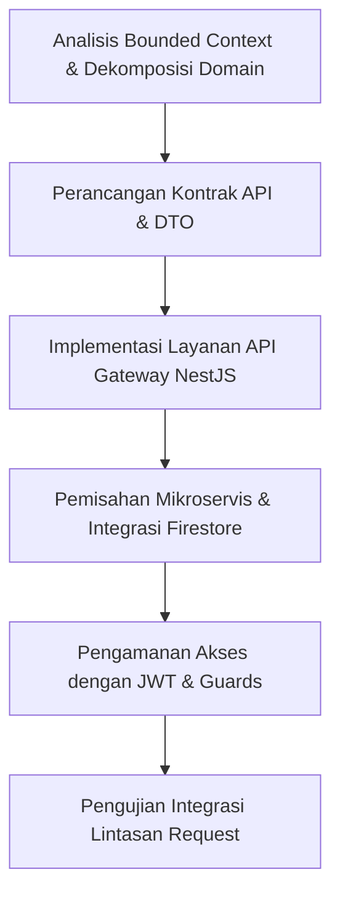

# LAPORAN ARSITEKTUR PERANGKAT LUNAK: VENTURA APP
## BAB I: PENDAHULUAN (INTRODUCTION)

### 1. Latar Belakang (Background)
Perencanaan perjalanan pariwisata sering kali menjadi proses yang kompleks dan menyita waktu bagi sebagian besar wisatawan. Tantangan umum yang sering dihadapi meliputi kesulitan dalam menentukan destinasi yang sesuai dengan preferensi, menyusun rencana perjalanan (*itinerary*) harian yang efisien, mengelola alokasi anggaran (*budgeting*), hingga memantau realisasi pengeluaran secara langsung saat perjalanan berlangsung. Akibat tidak adanya sistem yang terintegrasi, pengguna terpaksa menggunakan berbagai aplikasi terpisah, yang berujung pada inefisiensi waktu dan ketidakakuratan pengelolaan finansial.

Untuk mengatasi permasalahan tersebut, dikembangkan **Ventura**, sebuah aplikasi perencanaan perjalanan cerdas (*smart travel planning*). Ventura mengintegrasikan fitur-fitur esensial seperti *Destination Picker*, *Smart Budget Planner*, *Duration-Based Itinerary Generator*, *Category-Based Recommendation*, dan *Expense Tracker* ke dalam satu platform tunggal.

Dari perspektif rekayasa perangkat lunak, sistem backend Ventura dikembangkan dengan mengalami evolusi arsitektur secara bertahap guna menjamin kemudahan pemeliharaan dan keandalan sistem:
1. **Arsitektur Monolitik (*Monolithic Architecture*)**: Pada tahap awal, seluruh fungsionalitas aplikasi diimplementasikan di dalam satu basis kode tunggal. Pendekatan ini mempermudah proses inisialisasi awal namun menyulitkan skalabilitas seiring bertambahnya fitur.
2. **Arsitektur Berlapis (*Layered Architecture*)**: Sebagai langkah refactoring pertama, kode didekomposisi ke dalam lapisan-lapisan logis yang terpisah (seperti *controller*, *service*, *model/DTO*, dan *routes*) untuk memisahkan tanggung jawab (*separation of concerns*) dan merapikan struktur kode.
3. **Arsitektur Mikroservis (*Microservices Architecture*)**: Untuk mengoptimalkan skalabilitas horizontal dan isolasi kesalahan (*fault isolation*), sistem didekomposisi sepenuhnya menjadi tiga mikroservis independen (*Auth Service*, *Finance Service*, dan *Travel Service*) yang dikoordinasikan melalui sebuah *API Gateway*.

---

### 2. Tujuan (Objective)
Tujuan dari pengembangan aplikasi dan analisis arsitektur Ventura dijabarkan ke dalam dua aspek utama:

* **Tujuan Aplikasi / Fungsional (*App Objective*)**
  * Menyediakan platform perencanaan perjalanan yang cerdas dan terintegrasi, yang memungkinkan pengguna untuk mencari destinasi wisata, menghasilkan rencana perjalanan berbasis durasi secara otomatis, menyusun anggaran perjalanan, serta mencatat dan melacak pengeluaran secara real-time untuk meminimalkan risiko pengeluaran berlebih (*overspending*).

* **Tujuan Teknis / Ilmu Komputer (*Computer Science & Technical Objective*)**
  * Mengimplementasikan arsitektur *microservices* terdesentralisasi berbasis **NestJS** dengan menerapkan *API Gateway Pattern* guna mencapai tingkat keterikatan antar-komponen yang rendah (*loose coupling*), skalabilitas horizontal yang mandiri pada tiap servis (*independent deployability*), serta peningkatan ketahanan sistem terhadap kegagalan parsial (*fault tolerance*).

---

### 3. Metodologi untuk Mencapai Tujuan (Methodology)
Untuk mewujudkan tujuan fungsional dan teknis di atas, metodologi pengembangan yang diterapkan meliputi langkah-langkah sistematis sebagai berikut:

1. **Analisis *Bounded Context* & Dekomposisi Domain**: Mengidentifikasi batas-batas domain bisnis utama pada sistem monolitik, kemudian membaginya menjadi unit layanan independen berbasis fungsi bisnis spesifik:
   * **Auth Service**: Mengelola manajemen pengguna, pendaftaran, masuk (*login*), dan otorisasi.
   * **Finance Service**: Mengelola entitas pengeluaran (*expense*) dan pembuatan anggaran (*budget*).
   * **Travel Service**: Mengelola basis data destinasi dan modul generator rencana perjalanan (*itinerary*).
2. **Perancangan Kontrak API dan DTO**: Menentukan skema pertukaran data antar-layanan menggunakan *Data Transfer Object* (DTO) serta pustaka validator NestJS (`class-validator`) guna memastikan setiap payload request terverifikasi di batas sistem sebelum diproses.
3. **Implementasi API Gateway**: Membangun *API Gateway* menggunakan NestJS (berjalan pada Port 3000) yang bertindak sebagai *single entry point* bagi aplikasi klien (Flutter). Gateway bertanggung jawab melakukan routing request menggunakan modul `@nestjs/axios` secara dinamis ke port masing-masing mikroservis.
4. **Integrasi Database NoSQL Terdistribusi**: Menggunakan Firebase Firestore sebagai penyimpanan dokumen yang fleksibel untuk memfasilitasi kebutuhan penyimpanan data yang tidak terstruktur secara efisien dan mendukung sinkronisasi real-time.
5. **Penerapan Keamanan Terdesentralisasi**: Mengintegrasikan protokol keamanan JWT menggunakan Passport.js dan pengamanan endpoint via JWT Guards, memastikan data pengguna terproteksi di setiap mikroservis.

---

### 4. Batasan Studi (Study Limitation)
Studi arsitektur dan implementasi sistem Ventura saat ini memiliki beberapa batasan ruang lingkup dan teknis:

1. **Komunikasi Antar-Layanan Sinkronous (Synchronous Communication)**: 
   API Gateway berkomunikasi dengan mikroservis secara sinkron menggunakan protokol HTTP/REST (melalui pustaka Axios). Hal ini dapat menyebabkan masalah *blocking I/O* dan latensi kumulatif jika salah satu servis mengalami beban kerja tinggi atau respons lambat. Sistem belum mengadopsi komunikasi asinkron berbasis *event-driven* menggunakan *Message Broker* (seperti RabbitMQ, Apache Kafka, atau Redis Pub/Sub).
2. **Transaksi Terdistribusi (*Distributed Transactions*)**: 
   Penyimpanan data pada Firebase Firestore dikelola secara terpisah oleh masing-masing mikroservis. Sistem belum menerapkan pola penanganan transaksi terdistribusi (seperti *Saga Pattern*) untuk menjaga konsistensi data transaksional lintas servis (*eventual consistency*) jika terjadi kegagalan sistem di tengah proses eksekusi multi-layanan.
3. **Keterbatasan Lingkungan Pengembangan Lokal (Local Deployment Environment)**: 
   Orkestrasi dan jalannya servis masih bergantung pada eksekusi skrip lokal (`run-ventura.bat`) pada mesin fisik yang sama dengan alokasi port statis (Port 3000-3003). Sistem belum dideploy ke lingkungan kontainerisasi dinamis (seperti Docker dan Kubernetes) yang mendukung *service discovery*, *auto-scaling*, dan *load balancing* otomatis.
4. **Ketergantungan Firebase Admin SDK**: 
   Autentikasi terdistribusi sangat bergantung pada validasi token eksternal langsung menggunakan SDK Firebase di masing-masing mikroservis. Belum adanya lapisan *caching* lokal (misalnya Redis) untuk menyimpan status sesi JWT dapat memicu *overhead* verifikasi token yang berulang ke server Firebase.
